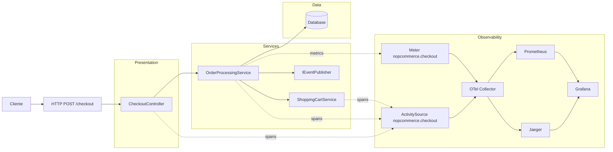

# Assignment 1 - nopCommerce + OpenTelemetry

## 1. Arquitetura do fluxo instrumentado

Entrypoint e pontos de instrumentação:
- src/Presentation/Nop.Web/Controllers/CheckoutController.cs
- src/Libraries/Nop.Services/Orders/OrderProcessingService.cs
- src/Libraries/Nop.Services/Orders/ShoppingCartService.cs
- src/Presentation/Nop.Web/Program.cs



## 2. Spans e métricas

### Spans usadas

- checkout.place_order

### Spans secundárias
- checkout.prepare_place_order_details
- checkout.process_payment
- checkout.save_order_details
- checkout.move_cart_items_to_order_items
- checkout.publish_order_placed_event
- checkout.check_order_status
- checkout.process_order_paid
- checkout.inventory_reserve
- checkout.inventory_return
- checkout.cart_add_item
- checkout.cart_update_item

### Métricas customizadas

- checkout_orders_total
- checkout_order_failures_total
- checkout_payment_duration_ms

### Justificação operacional

1. checkout_orders_total + checkout_order_failures_total permitem calcular error rate real do pipeline de checkout.
2. checkout_payment_duration_ms permite detetar degradação antes de falhas generalizadas.

## 3. Estratégia de privacidade

Objetivo: evitar PII em spans/métricas.

Decisões aplicadas:
- Atributos limitados a IDs técnicos e estado de execução
- Sem email, sem payload de pagamento, sem dados pessoais em tags

Tradeoff:
- A redação principal está antes de enviar para o collector
- Evolução recomendada: sanitização central no collector para defesa em profundidade

## 4. Stack de observabilidade

Ficheiros:
- observability/docker-compose.yml
- observability/otel-config.yaml
- observability/prometheus.yml
- dashboard/dashboard.json

Serviços expostos localmente:
- Grafana: http://localhost:3000 (admin/admin)
- Jaeger: http://localhost:16686
- Prometheus: http://localhost:9090

## 5. Como executar (local)

Pré-requisitos:
- .NET 9 SDK
- Docker + Docker Compose
- k6 (para load test)

### Passo 1: ativar observabilidade

```powershell
cd observability
docker compose up -d
```

### Passo 2: iniciar o nopCommerce

```powershell
cd src/Presentation/Nop.Web
dotnet build
dotnet run
```

- http://localhost:5000

### Passo 3: abrir Grafana e importar dashboard

1. Abrir http://localhost:3000
2. Login: admin / admin
3. Importar dashboard/dashboard.json
4. Garantir datasources válidas para Prometheus e Jaeger

### Passo 4: executar loadtest

```powershell
cd loadtest
./run-demo-7min.ps1
```

Script principal:
- loadtest/checkout-opc.k6.js

## 6. Crítica arquitetural

A crítica completa está em:
- CRITIQUE.md